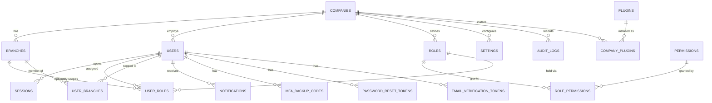
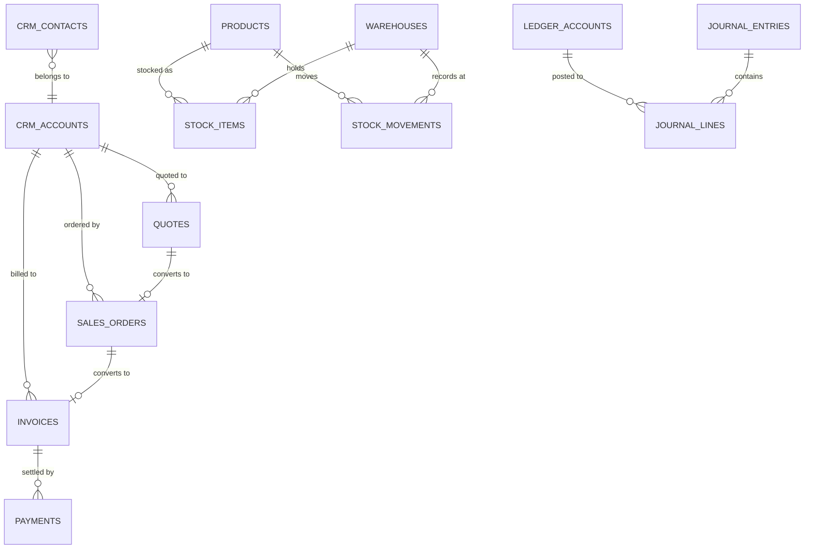
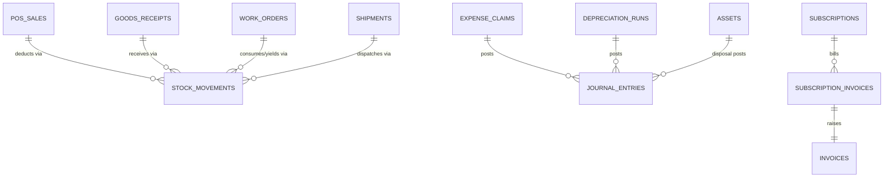
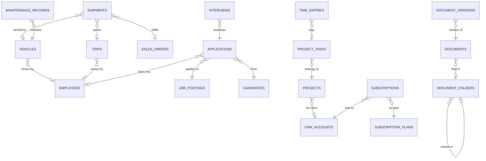

# Omniflow — Current Database ER Diagram

Generated from the live PostgreSQL schema (`omniflow`), 76 base tables,
187 foreign keys, 22 applied migrations. This documents **what exists
today**, not a proposed design.

## Tenancy topology

64 of the 76 tables carry a `company_id` FK pointing at `companies`,
which is the tenant root. The 12 that do not are listed under
"Tables without `company_id`" below, each with the reason.

`PERMISSIONS` and `PLUGINS` are **global** (no `company_id`) — they are
catalogue tables. Tenant binding happens through `ROLE_PERMISSIONS` and
`COMPANY_PLUGINS` respectively.

## Order-to-cash cluster (as currently wired)

**Gap visible in this diagram:** there is no edge from `SALES_ORDERS` or
`INVOICES` to `STOCK_MOVEMENTS`, and none from `INVOICES` to
`JOURNAL_ENTRIES`. Sales is structurally disconnected from Inventory and
Accounting — confirmed empirically in the end-to-end test.

## Modules that DO write into shared ledgers

## Cross-module reference edges

## Tables without `company_id` (12)

| Table | Reason | Verdict |
|---|---|---|
| `companies` | is the tenant root | correct |
| `permissions` | global catalogue | correct |
| `plugins` | global catalogue | correct |
| `_prisma_migrations` | tooling | correct |
| `role_permissions` | junction; scoped via `roles.company_id` | acceptable |
| `user_roles` | junction; scoped via `users.company_id` | acceptable |
| `user_branches` | junction; scoped via `users.company_id` | acceptable |
| `bom_lines` | child; scoped via `bills_of_material.company_id` | acceptable, no defence in depth |
| `journal_lines` | child; scoped via `journal_entries.company_id` | acceptable, no defence in depth |
| `sessions` | has `company_id`… **it does** (verified) | correct |
| `mfa_backup_codes` | scoped via `users` | acceptable |
| `password_reset_tokens` / `email_verification_tokens` | scoped via `users` | acceptable |

## Polymorphic (untyped) relationships

`attachments` and `comments` address their parent via
`(entity_type, entity_id)` with **no foreign key**. They carry
`company_id`, so cross-tenant reads are impossible, but:

- nothing prevents writing a comment against a non-existent or
  wrong-module `entity_id`;
- deleting a parent record leaves its comments and attachments behind
  (no cascade is possible without a real FK).
