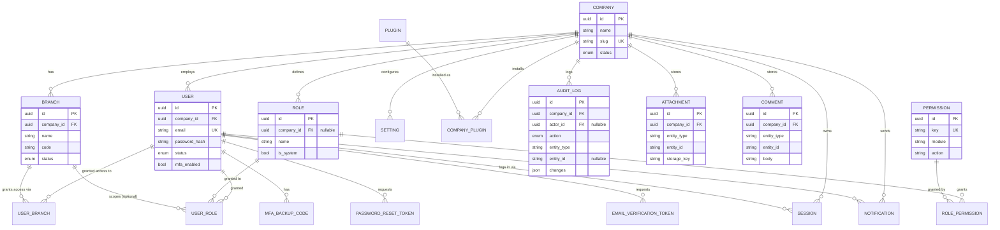

# Database

The Milestone 2 schema covers the **core platform layer**: tenancy,
identity, RBAC, and the cross-cutting tables every business module hangs
off of. Business-module tables (CRM, Sales, Inventory, ...) are added one
module at a time from Milestone 7 onward, alongside their own migrations.

Source of truth: [`packages/database/prisma/schema.prisma`](../../packages/database/prisma/schema.prisma).

## Conventions

- **Primary keys** are UUIDs, generated application-side by Prisma
  (`@default(uuid())`) — no cross-service coordination needed for ID
  generation, which matters once modules split into separate services.
- **Multi-tenancy**: every tenant-scoped table carries `company_id` and
  cascades on `Company` delete. A `Branch` belongs to a `Company`
  (multi-branch); a `User` belongs to one `Company` and is granted access
  to specific branches via `user_branches` (multi-branch access) and
  roles via `user_roles`, which can be scoped to a single branch or left
  company-wide (`branch_id IS NULL`).
- **Soft deletes**: `Company`, `Branch`, `User`, `Attachment`, and
  `Comment` carry `deleted_at`; hard deletes are reserved for legally
  required erasure, handled separately.
- **"Actor" references** (who did this) — `AuditLog.actorId`,
  `Attachment.uploadedById`, `Comment.authorId` — are nullable and
  `SET NULL` on delete, so history survives account deletion.
- **Polymorphic cross-cutting tables** — `attachments`, `comments`,
  `audit_logs` — reference their target via `(entity_type, entity_id)`
  rather than a foreign key, since the target can be any module's table
  (satisfies "every module includes attachments/comments/audit logs"
  without a join table per module).
- **Naming**: Postgres tables/columns are `snake_case` (via `@map`/`@@map`);
  Prisma-side fields stay `camelCase`.

## Entity-relationship diagram



## Indexes & constraints

Beyond the primary/foreign keys, notable indexes:

| Table | Index | Purpose |
| --- | --- | --- |
| `companies` | `status` | filter active/trial/suspended tenants |
| `branches` | unique `(company_id, code)` | branch codes unique per tenant |
| `users` | unique `email`; `(company_id, status)` | login lookup; active-user listing |
| `roles` | unique `(company_id, name)` | no duplicate role names per tenant |
| `permissions` | unique `key` | stable permission identifiers (`module:action`) |
| `user_roles` | unique `(user_id, role_id, branch_id)`; `role_id`; `branch_id` | prevent duplicate grants; reverse lookups |
| `sessions` | unique `refresh_token_hash`; `user_id`; `expires_at` | token lookup on refresh; sweep expired sessions |
| `audit_logs` | `(company_id, entity_type, entity_id)`; `(company_id, created_at)` | "history for this record"; recent-activity feed |
| `notifications` | `(user_id, read_at)`; `(company_id, created_at)` | unread inbox; recent feed |
| `attachments` / `comments` | `(company_id, entity_type, entity_id)` | "attachments/comments for this record" |
| `settings` | unique `(company_id, key)` | one value per settings key per tenant |

## Views, triggers, and a stored procedure

Layered on top of the Prisma-managed tables in a second, hand-written
migration (`prisma/migrations/20260721083942_core_views_triggers_procedures`):

- **Trigger `set_updated_at()`** — applied to `companies`, `branches`,
  `users`, `roles`, `settings`, `comments`; keeps `updated_at` current at
  the database layer regardless of caller (defense in depth beyond
  Prisma's `@updatedAt`).
- **View `active_users`** — one row per non-deleted user with company
  name and aggregated branch/role names, for admin user listings.
- **View `company_dashboard_stats`** — per-company branch/user/
  notification counts, feeding the executive dashboard (Milestone 5) and
  BI module without every consumer re-deriving the aggregation.
- **Stored procedure `soft_delete_company(uuid)`** — cascades a
  soft-delete across a company's branches/users/comments/attachments and
  marks the company `CANCELLED`. Prisma's declarative `onDelete: Cascade`
  only cascades *hard* deletes, so this offboarding path needed to be
  written explicitly.

## Local development

```bash
cd packages/database
cp .env.example .env        # set DATABASE_URL / SHADOW_DATABASE_URL
pnpm migrate                # applies migrations (creates a new one if the schema changed)
pnpm seed                   # permission catalog + demo company/roles/admin
pnpm studio                 # Prisma Studio, a GUI over the database
```

Seeded demo login (after `pnpm seed`): company slug `omniflow-demo`,
email `admin@omniflow-demo.com`, password `Admin@12345`.

In CI (see `.github/workflows/ci.yml`), migrations are applied with
`prisma migrate deploy` against a fresh Postgres service container on
every run, so a broken migration fails the build.
